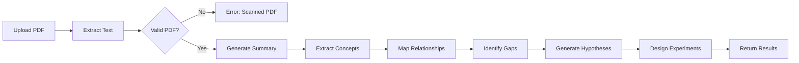

# 🔬 HypoGen - AI-Powered Research Paper Analyzer


Transform research papers into breakthroughs with AI-powered analysis. **HypoGen** helps researchers, students, and academics automatically extract insights, generate hypotheses, and design experiments from scientific papers using Google's Gemini AI.

## ✨ Features

### 📄 Intelligent PDF Analysis
- **Text Extraction**: Automatically extracts text from research papers
- **Quality Validation**: Distinguishes text-based PDFs from scanned images
- **Smart Chunking**: Intelligently handles long documents for optimal AI processing

### 🧠 Advanced NLP Analysis
- **Research Summaries**: Get concise 150-200 word summaries of papers
- **Concept Extraction**: Identify 8-10 most important concepts
- **Relationship Mapping**: Visualize connections between concepts in knowledge graphs
- **Gap Identification**: Discover 4 key research gaps and limitations

### 🔮 Hypothesis Generation
- **Ranked Hypotheses**: Generate 3 hypotheses at different complexity levels:
  - 🟢 **Basic**: Incremental improvements on existing work
  - 🟡 **Intermediate**: Moderate novelty combining existing approaches
  - 🔴 **Advanced**: High-risk, high-reward innovative ideas

### 🧪 Experiment Design
- **Structured Plans**: Get detailed experiment design for each hypothesis
- **Methodology Steps**: Clear, numbered experimental procedures
- **Resource Requirements**: Identify required data and tools
- **Evaluation Metrics**: Proposed metrics for measuring success

### 👥 User Management
- **Secure Authentication**: User registration and login with bcrypt password hashing
- **Session Management**: Persistent sessions with Flask-Login
- **User Isolation**: Each user's analyses are kept secure

## 🚀 Quick Start

### Prerequisites
- Python 3.12 or higher
- Google Gemini API key
- Flask and dependencies

### Installation

1. **Clone the repository**
```bash
git clone https://github.com/yourusername/hypogen.git
cd hypogen
```

2. **Create a virtual environment**
```bash
python -m venv hypo
# Windows
hypo\Scripts\activate
# macOS/Linux
source hypo/bin/activate
```

3. **Install dependencies**
```bash
pip install -r backend/requirements.txt
```

4. **Set up environment variables**
Create a `.env` file in the `backend/` directory:
```env
GEMINI_API_KEY=your_api_key_here
SECRET_KEY=your_secret_key_here
```

5. **Run the application**
```bash
cd backend
python main.py
```

6. **Access the application**
Open your browser and navigate to:
```
http://localhost:5000
```

## 📁 Project Structure

```
hypothesis_gen/
├── backend/                    # Flask backend application
│   ├── main.py                # Flask app entry point & routes
│   ├── database.py            # SQLAlchemy models & database config
│   ├── pdf_extractor.py       # PDF text extraction utilities
│   ├── llm_service.py         # Gemini AI integration & analysis
│   ├── requirements.txt        # Python dependencies
│   ├── templates/             # HTML templates
│   │   ├── index.html         # Main dashboard
│   │   ├── login.html         # Login page
│   │   └── register.html      # Registration page
│   └── static/                # Frontend assets
│       ├── style.css          # Styling
│       └── scripts.js         # Frontend logic
├── .env                        # Environment variables (not in repo)
├── .gitignore                 # Git ignore rules
└── README.md                  # This file
```

## 🔑 API Endpoints

### Authentication
| Method | Endpoint | Description |
|--------|----------|-------------|
| GET/POST | `/login` | User login |
| GET/POST | `/register` | User registration |
| GET | `/logout` | User logout |

### Analysis
| Method | Endpoint | Description |
|--------|----------|-------------|
| POST | `/analyze` | Upload PDF and analyze (requires authentication) |

**Request Example:**
```bash
curl -X POST -F "file=@paper.pdf" http://localhost:5000/analyze \
  -H "Authorization: Bearer your_token"
```

**Response Example:**
```json
{
  "status": "success",
  "filename": "research_paper.pdf",
  "summary": "This paper presents...",
  "concepts": ["BERT", "NLP", "Transformer", ...],
  "graph": {
    "nodes": ["BERT", "NLP", ...],
    "edges": [
      {"subject": "BERT", "relation": "improves", "object": "accuracy"},
      ...
    ]
  },
  "gaps": [
    "Limited dataset generalizability",
    "No cross-domain testing",
    ...
  ],
  "hypotheses": [
    {
      "level": "Basic",
      "hypothesis": "...",
      "rationale": "..."
    },
    ...
  ],
  "experiments": [
    {
      "hypothesis": "...",
      "objective": "...",
      "methodology": "...",
      "required_data": "...",
      "evaluation_metrics": "...",
      "expected_outcome": "..."
    },
    ...
  ]
}
```

## 🛠 Technology Stack

### Backend
- **Flask** - Lightweight web framework
- **Flask-SQLAlchemy** - ORM for database management
- **Flask-Login** - User session management
- **Flask-CORS** - Cross-origin resource sharing

### AI & NLP
- **Google Generative AI** - Gemini AI API
- **PyMuPDF** - PDF text extraction

### Security
- **bcrypt** - Password hashing and verification
- **python-dotenv** - Environment variable management

### Frontend
- **HTML5/CSS3** - Modern web standards
- **Cytoscape.js** - Knowledge graph visualization
- **Vanilla JavaScript** - Dynamic interactions

## 🔐 Security Considerations

- ✅ **Password Hashing**: bcrypt with salt for secure password storage
- ✅ **Environment Variables**: API keys stored in `.env` (never committed)
- ✅ **Session Management**: Secure session cookies with Flask-Login
- ✅ **CORS Protection**: Configurable cross-origin access
- ✅ **Input Validation**: PDF file type validation on upload
- ✅ **Temporary File Cleanup**: Uploaded PDFs deleted after processing

## 📚 Key Modules

### `main.py` - Flask Application
Handles all HTTP endpoints:
- User authentication (registration, login, logout)
- File upload and PDF processing
- API responses with analysis results

### `database.py` - Database Models
- **User Model**: Stores user information with encrypted passwords
- `set_password()`: Hash passwords using bcrypt
- `check_password()`: Verify passwords securely

### `pdf_extractor.py` - PDF Processing
- `extract_text()`: Extract text from PDF files
- `is_valid_pdf()`: Validate PDF contains readable text
- `smart_chunk()`: Intelligently truncate long texts for LLM processing

### `llm_service.py` - AI Analysis Engine
Core functions for research analysis:
- `generate_summary()`: Create paper summaries
- `extract_concepts()`: Identify key concepts
- `extract_relations()`: Map concept relationships
- `identify_gaps()`: Find research gaps
- `generate_hypotheses()`: Generate ranked hypotheses
- `design_experiments()`: Create experiment plans

## 🎯 How It Works



## 📊 Example Usage Flow

1. **Register/Login**: Create account or sign in
2. **Upload Paper**: Select and upload a research paper PDF
3. **Wait for Analysis**: AI processes the paper (typically 30-60 seconds)
4. **Review Results**: 
   - Read the AI-generated summary
   - Explore the knowledge graph of concepts
   - Review identified research gaps
   - Study generated hypotheses
   - Read proposed experiment designs
5. **Take Action**: Use insights for your research

## 🤝 Contributing

Contributions are welcome! Please follow these guidelines:

1. **Fork the repository**
2. **Create a feature branch** (`git checkout -b feature/amazing-feature`)
3. **Commit your changes** (`git commit -m 'Add amazing feature'`)
4. **Push to the branch** (`git push origin feature/amazing-feature`)
5. **Open a Pull Request**

### Contribution Areas
- 🐛 Bug fixes and improvements
- 📚 Documentation enhancements
- 🧪 Additional analysis features
- 🎨 UI/UX improvements
- 📈 Performance optimizations
- 🌍 Language support

See [CONTRIBUTING.md](CONTRIBUTING.md) for detailed guidelines.

## 📝 License

This project is licensed under the MIT License - see the [LICENSE](LICENSE) file for details.

## 🙏 Acknowledgments

- **Google Gemini API** for powerful AI capabilities
- **Flask** community for the excellent web framework
- **PyMuPDF** for robust PDF processing
- **Cytoscape.js** for beautiful graph visualizations

## 📧 Contact & Support

- 💬 **Issues**: [GitHub Issues](https://github.com/yourusername/hypogen/issues)
- 💭 **Discussions**: [GitHub Discussions](https://github.com/yourusername/hypogen/discussions)
- 📧 **Email**: contact@hypogen.ai

## 🗺 Roadmap

### v1.1 (Upcoming)
- [ ] Multi-language support
- [ ] Batch PDF processing
- [ ] Research paper comparison
- [ ] Custom analysis templates
- [ ] Export to PDF/Word formats

### v2.0 (Future)
- [ ] Mobile application
- [ ] Real-time collaboration
- [ ] Advanced citation analysis
- [ ] Integration with academic databases
- [ ] Custom LLM model support

---

**Made with ❤️ for researchers and academics**

*Last Updated: April 4, 2024*
